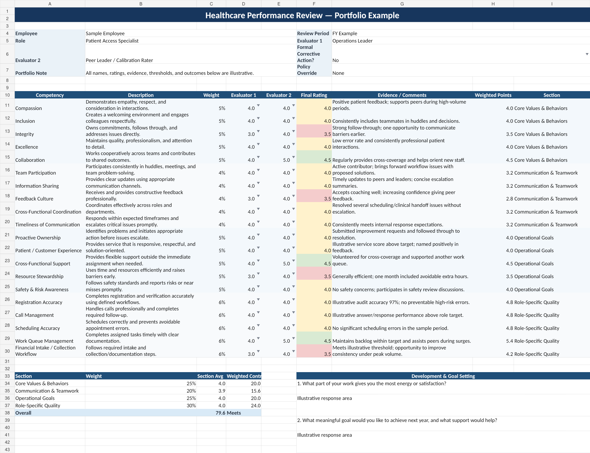

# Healthcare Performance Management Framework

## Professional Work Sample

This repository contains a **recreated and sanitized professional work sample** based on a healthcare performance-management framework I designed in ambulatory operations.

The original framework was built to move performance reviews away from broad, subjective expectations and toward a more structured system combining observable behaviors, operational performance, role-specific quality measures, evidence, rater calibration, and development planning.

Employer-specific language, internal benchmarks, employee information, proprietary reports, organizational links, and exact policy thresholds have been removed or replaced with illustrative examples.

## Preview

## Business Problem

Traditional performance reviews can become overly subjective when employees and leaders do not have a shared definition of what different performance levels look like.

The framework was designed to answer several practical questions:

- What does performance at each level actually look like?
- How can leaders differentiate expected performance from exceptional performance?
- How should team behaviors and operational results be considered together?
- How can role-specific quality measures be incorporated without evaluating employees on factors outside their control?
- How can a second rater or calibration process improve consistency?
- How can the review process end with meaningful development planning rather than only a score?

## Framework Design

The portfolio version includes four performance domains:

1. **Core Values & Behaviors**
2. **Communication & Teamwork**
3. **Operational Goals**
4. **Role-Specific Quality**

The workbook demonstrates:

- 1–5 behavioral rating anchors
- two-rater calibration
- evidence and comments fields
- weighted performance scoring
- a configurable management-review flag
- role-specific metric examples
- development and goal-setting prompts
- implementation and governance guidance

## Files

- `healthcare-performance-management-framework.xlsx` — interactive sanitized performance framework
- `performance-rubric-preview.png` — visual preview of the review scorecard
- `design-methodology.md` — design decisions, governance principles, and implementation approach

## Skills Demonstrated

- Performance-management system design
- KPI and metric development
- Workforce management
- Healthcare operations
- People leadership
- Leadership calibration
- Process standardization
- Change management
- Coaching and development
- Operational governance

## Confidentiality

This is not the employer's original performance-review document.

It is a recreated portfolio artifact designed to demonstrate the underlying framework and problem-solving approach while protecting confidential employer information, employee data, internal performance results, and proprietary materials.
